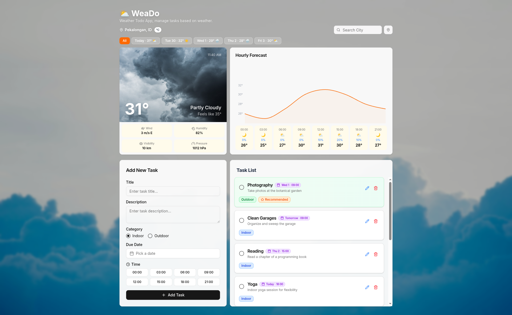

# ⛅ WeaDo

**Weather Todo app** is React based task management app integrated with the OpenWeatherMap API. Provides task priority recommendations based on weather conditions, indoor tasks are prioritized when it's raining, outdoor tasks when it's sunny.

## 🧑‍💻 Author

I Gede Arya Danny Pratama

## 🌐 Live Website

- 🔗 <https://weado.igdarya.com>
- 🔗 <https://weado-igdarya.vercel.app/>

## Design references

- [Open Weather API](https://openweathermap.org/)

- [Microsoft To Do](https://to-do.office.com)

## Screenshots




## Figma Design

🔗 <https://www.figma.com/design/stLySXmtNTG6Vo8KwwVHQl/Weather-Todo-APP>

## Flowchart


## What it does

- Full CRUD for tasks, saved to localStorage (persists on refresh)
- Recommends tasks based on current weather condition
- Tasks are sorted by priority: recommended first, then active, overdue, and completed last
- Overdue tasks get flagged automatically when the due date passes
- Calendar date picker limited to the 5-day forecast window
- Time picker as a grid of buttons (not a dropdown)
- Day filter tabs to view tasks per day
- Delete confirmation dialog before removing a task
- Toast notifications on create, update, and delete
- Weather card updates dynamically when switching days (chart, background, details all change)
- Shows real current time on the weather card

## What's next

- Hook up OpenWeatherMap API for real weather data
- Auto-detect location or let users search cities
- Move task storage to a backend/database
- Add user auth

## Tech

- React 19, TypeScript, Vite 8
- Bun as runtime and package manager
- Tailwind CSS v4, shadcn/ui components
- react-day-picker, sonner, recharts, date-fns, lucide-react

## Structure

```
src/
├── app.tsx
├── main.tsx
├── index.css
├── components/
│   ├── header.tsx
│   └── ui/                    # shadcn components
├── lib/
│   ├── utils.ts               # cn() helper
│   └── format.ts              # date formatting
└── modules/
    ├── task/
    │   ├── task.type.ts
    │   ├── task.constant.ts
    │   ├── task.data.ts       # seed/default data
    │   ├── task.storage.ts    # localStorage logic
    │   ├── task.hooks.ts      # useTasks() hook
    │   └── components/
    │       ├── task-card.tsx
    │       └── task-form.tsx
    ├── task-list/
    │   ├── task-list.type.ts
    │   ├── task-list.constant.ts
    │   ├── task-list.data.ts  # sorting, filtering, recommendation
    │   └── components/
    │       └── task-list.tsx
    └── weather/
        ├── weather.type.ts
        ├── weather.constant.ts
        ├── weather.data.ts    # simulated data (dynamic dates)
        └── components/
            └── weather-card.tsx
```

## Getting started

```bash
bun install
bun dev
```

When API integration is ready, create a `.env` file:

```
VITE_OPENWEATHERMAP_API_KEY=your_key_here
```

Get one from [OpenWeatherMap](https://openweathermap.org/api).

## Scripts

| Command         | What it does         |
| --------------- | -------------------- |
| `bun dev`       | Dev server           |
| `bun run build` | Production build     |
| `bun lint`      | Lint with ESLint     |
| `bun format`    | Format with Prettier |
| `bun preview`   | Preview the build    |
