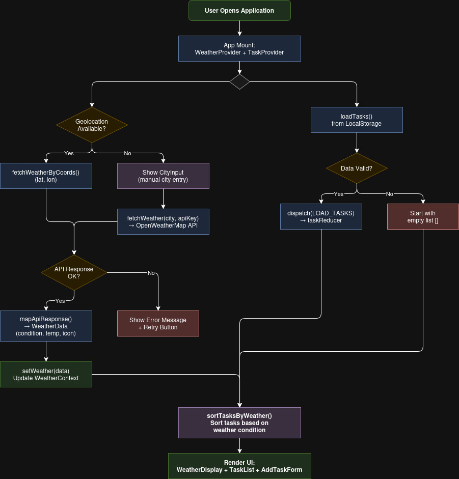
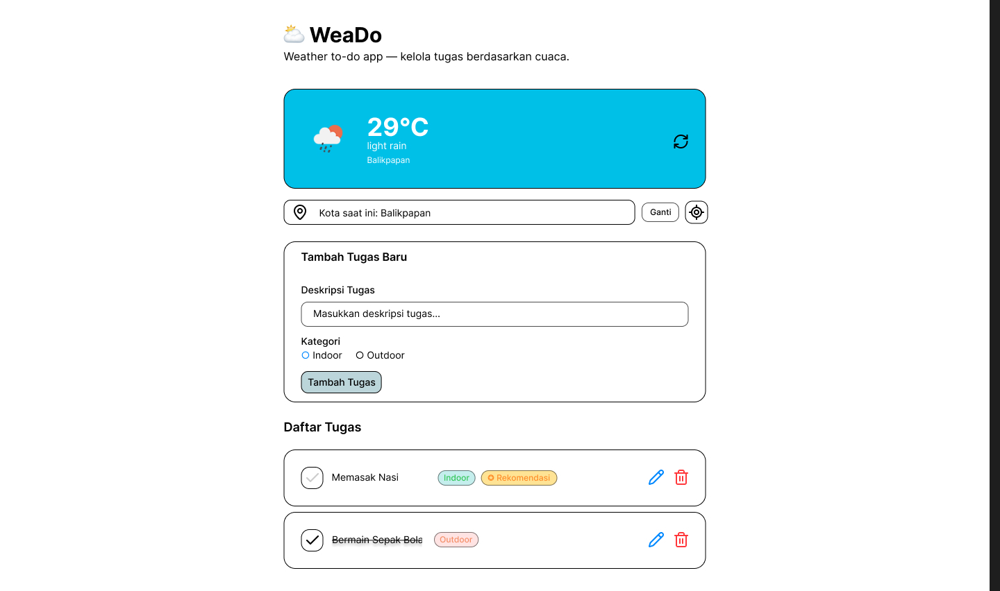

# ⛅ WeaDo

**Weather Todo app** is React based task management app integrated with the OpenWeatherMap API. Provides task priority recommendations based on weather conditions, indoor tasks are prioritized when it's raining, outdoor tasks when it's sunny.

## 🧑‍💻 Author

I Gede Arya Danny Pratama

## 🌐 Live Website

- 🔗 <https://weado.igdarya.com>
- 🔗 <https://weado-igdarya.vercel.app/>

## Features

- Add, edit, delete, and mark tasks as complete
- Real-time weather integration from OpenWeatherMap
- Automatic sorting by weather (indoor/outdoor)
- Recommendation badges on weather-appropriate tasks
- Persistent storage via localStorage
- Responsive design (mobile & desktop)
- Automatic geolocation or manual city input

## Tech Stack

- React 19 + TypeScript
- Vite
- Bun (runtime & package manager)
- Tailwind CSS v4 + shadcn/ui
- Vitest + React Testing Library + fast-check

## Design & Inspiration

- [Open Weather API](https://openweathermap.org/)
- [Microsoft To Do](https://to-do.office.com)

## Figma Design

🔗 <https://www.figma.com/design/stLySXmtNTG6Vo8KwwVHQl/Weather-Todo-APP>

## Flowchart



## Screenshot



## Setup

- Clone the repository and install dependencies:

```bash
bun install
```

- Create `.env` file from template:

```bash
cp .env.example .env
```

- Get the API key from [OpenWeatherMap](https://openweathermap.org/api) and put it in `.env`:

```text
OPENWEATHERMAP_API_KEY=your_actual_api_key
```

- Run the development server:

```bash
bun run dev
```

- Run TypeScript files directly (no compile needed):

```bash
bun src/data/tasks.ts
```

## Scripts

| Command              | Description              |
| -------------------- | ------------------------ |
| `bun run dev`        | Start development server |
| `bun run build`      | Build for production     |
| `bun run test`       | Run tests (single run)   |
| `bun run test:watch` | Run tests in watch mode  |
| `bun run lint`       | Run ESLint               |
| `bun run format`     | Format code via Prettier |
| `bun run preview`    | Preview production build |
